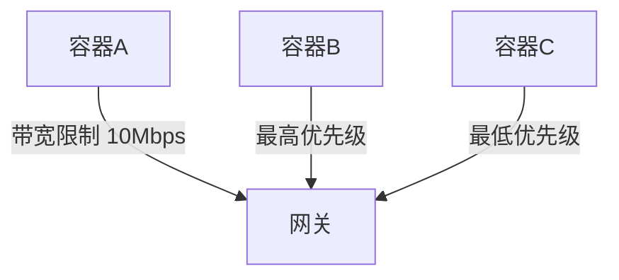

# Docker (二)

# 1. Docker 网络

### 1.1 简介

**为什么需要 Docker 网络管理**

#### **1. 容器通信需求（基础动力）**

- **容器互联互通**

  - 微服务架构下不同容器（如 Web 前端 + 数据库 + 缓存）需相互通信：

  ```bash
  # 创建容器时自动连接默认网络
  docker run -d --name web nginx
  docker run -d --name mysql -e MYSQL_ROOT_PASSWORD=123 mysql
  ```

- **服务发现机制**
  - 容器通过**容器名称自动 DNS 解析**，无需记录 IP（如 `mysql:3306`）

#### **2. 网络隔离（安全关键）**

|     场景     |        需求        |           Docker 实现            |
| :----------: | :----------------: | :------------------------------: |
|  多项目环境  | 隔离开发/测试/生产 | `docker network create prod-net` |
| 敏感服务隔离 | 数据库不与前端直连 |         划分独立网络分区         |
|   安全防护   |  限制非法访问路径  |     默认网络策略阻断跨网通信     |

#### **3. 内外网络连接（服务暴露）**

- **入站访问控制**
  - **入站访问控制**

```bash
docker run -d -p 80:8080 myapp  # 宿主机80端口映射到容器8080
```

- **出站网络策略**
  - 控制容器访问外网权限

```bash
docker network create no-internet --internal
```

#### **4. 多主机组网（分布式扩展）**

- **跨节点容器通信**
  - Swarm/Kubernetes 集群中容器需跨物理机互通：

```bash
docker network create -d overlay cluster-net
```

- **网络插件集成**
  - 跨云网络互通
  - 微隔离策略
  - 网络性能监控

#### **5. 流量管控（运维保障）**



- **QoS 保障**：关键业务容器优先通行
- **带宽限制**：防止单容器耗尽带宽
- **流量监控**：`docker stats` 实时观测

### 1.2 Docker 中有哪些网络驱动模式

**Docker 有五种网络驱动模式**

- bridge network 模式（网桥）：默认的网络模式。类似虚拟机的 nat 模式
- host network 模式（主机）：容器与宿主机之间的网络无隔离，即容器直接使用宿主机网络
- None network 模式：容器禁用所有网络。
- Overlay network 模式（覆盖网络）： 利用 VXLAN 实现的 bridge 模式

- Macvlan network 模式：容器具备 Mac 地址，使其显示为网络上的物理设备

### 1.3Docker 网络管理命令

#### 1. 查看网络 – docker network ls

- **作用**：查看已经建立的网络对象

- **命令格式**：docker network ls [OPTIONS]

- **命令参数（OPTIONS）**：
- -f, --filter filter 过滤条件(如 'driver=bridge’)
- --format string 格式化打印结果
- --no-trunc 不缩略显示

- -q, --quiet 只显示网络对象的 ID

```bash
# 查看网络(默认情况下，docker安装完成后，会自动创建bridge、host、none三种网络驱动)
[root@lavm-zo7f3xq5c6 ~]# docker network ls
NETWORK ID     NAME      DRIVER    SCOPE
cf440d390e12   bridge    bridge    local
77af46120087   host      host      local
7f7b53529fb3   none      null      local

```

#### 2. 创建网络 – docker network create

- **作用**：创建新的网络对象

- **命令格式**：docker network create [OPTIONS] NETWORK

- **命令参数（OPTIONS）**：

  - -d, --driver string 指定网络的驱动(默认 "bridge")

  - --format string 指定子网网段(如 192.168.0.0/16、172.88.0.0/24)

  - --no-trunc 执行容器的 IP 范围，格式同 subnet 参数

  - -q, --quiet 子网的 IPv4 or IPv6 网关，如(192.168.0.1)

```bash
# 创建 网络 bridge模式
[root@lavm-zo7f3xq5c6 ~]# docker network create -d bridge  my-bridge
f5e6b44a050cbd486bc4b76084100927ae69349d5face6a2213f1e46844c3cdf
# 查看网络
[root@lavm-zo7f3xq5c6 ~]# docker network ls
NETWORK ID     NAME        DRIVER    SCOPE
cf440d390e12   bridge      bridge    local
77af46120087   host        host      local
f5e6b44a050c   my-bridge   bridge    local
7f7b53529fb3   none        null      local

# host和none模式网络只能存在一个
# 创建 网络 host模式
[root@lavm-zo7f3xq5c6 ~]# docker network create -d host  my-host
Error response from daemon: only one instance of "host" network is allowed
# 创建 网络 none模式
[root@lavm-zo7f3xq5c6 ~]# docker network create -d null  my-null
Error response from daemon: only one instance of "null" network is allowed
# 创建 网络 overlay
[root@lavm-zo7f3xq5c6 ~]# docker network create -d overlay  my-overlay
# docker自带的overlay 网络创建依赖于docker swarm(集群负载均衡)服务
Error response from daemon: This node is not a swarm manager. Use "docker swarm init" or "docker swarm join" to connect this node to swarm and try again.
# 创建 网络 macvlan模式
[root@lavm-zo7f3xq5c6 ~]# docker network create -d macvlan  my-macvlan
d670a3bf8e2adfa4ecda3504c7a07f8591905e436aeed9224b9ef73b1d893e52
# 查看网络
[root@lavm-zo7f3xq5c6 ~]# docker network ls
NETWORK ID     NAME         DRIVER    SCOPE
cf440d390e12   bridge       bridge    local
77af46120087   host         host      local
f5e6b44a050c   my-bridge    bridge    local
d670a3bf8e2a   my-macvlan   macvlan   local
7f7b53529fb3   none         null      local


```

#### 3. 网络删除 – docker network rm

- **作用**：删除一个或多个网络

- **命令格式**：docker network rm NETWORK [NETWORK...]

- **命令参数（OPTIONS）**：

```bash
# 删除 my-macvlan
docker network rm my-macvlan
```

#### 4.查看网络详细信息 – docker network inspect

- **作用**：查看一个或多个网络的详细信息
- **命令格式**：docker network inspect [OPTIONS] NETWORK [NETWORK...]
- **命令参数（OPTIONS）**：

  - -f, --format string 根据 format 输出结果

```bash

#
docker  inspect  bridge
#
[root@lavm-zo7f3xq5c6 ~]# docker  network  inspect -f '{{index .IPAM.Config }}' bridge
[{172.17.0.0/16  172.17.0.1 map[]}]

```

#### 5.使用网络 – docker run --network

- **作用**：为启动的容器指定网络模式
- **命令格式**：docker run/create --network NETWORK
- **命令参数（OPTIONS）**：

```bash
# centos使用my-bridge网络
docker run --network  my-bridge  -dti centos bash
```

#### 6.网络连接与断开 – docker network connect/disconnect

- **作用**：将指定容器与指定网络进行连接或者断开连接
- **命令格式**：docker network connect /disconnect [OPTIONS] NETWORK CONTAINER
- **命令参数（OPTIONS）**：
  - -f, --force 强制断开连接(用于 disconnect)

```bash
 # 断开
 docker network disconnect my-bridge centos
 # 连接
  docker network disconnect my-bridge centos
```

### 1.4 Docker 网络模式简介

#### 1. bridge 网络模式

**特点**

- 宿主机上需要单独的 bridge 网卡，如默认 docker 默认创建的 docker0。
- 容器之间、容器与主机之间的网络通信，是借助为每一个容器生成的一对 veth pair 虚拟网络设备对，进行通信的。一个在容器上，另一个在宿主机上
- 每创建一个基于 bridge 网络的容器，都会自动在宿主机上创建一个 veth\*\*虚拟网络设备

- 外部无法直接访问容器。需要建立端口映射才能访问。

- 容器借由 veth 虚拟设备通过如 docker0 这种 bridge 网络设备进行通信。

- 每一容器具有单独的 IP
  

  ##### 端口映射 – docker run/create -P

- **作用**：启动的容器时，为容器进行端口映射
- **命令格式**：docker run/create -P
- **命令参数（OPTIONS）**：
  - -P(大写), --publish-all 将容器内部所有暴露端口进行随机映射
  - -p（小写）, --publish list 手动指定端口映射

```bash

# 运行 redis
docker run -dti -P redis
# 随机映射 主机=》容器 端口
0.0.0.0:36271->6379/tcp,

#运行 redis
docker run -dti -p :6379:6379 redis

# 指定 主机=》容器 端口
0.0.0.0:6379->6379/tcp,
```

#### 2.host 网络模式

**特点**

- 容器完全共享宿主机的网络。网络没有隔离。宿主机的网络就是容器的网络
- 容器、主机上的应用所使用的端口不能重复。例如：如果宿主机已经占用了 8090 端口，那么任何一个 host 模式的容器都不可以使用 8090 端口了；反之同理。

- 外部可以直接访问容器，不需要端口映射。
- 容器的 IP 就是宿主机的 IP


#### 3. none 网络模式

**特点**

- 容器上没有网络，也无任何网络设备。
- 如果需要使用网络，需要用户自行安装与配置。

**应用场景**

- 该模式适合需要高度定制网络的用户使用。

#### 4.overlay 网络模式

**特点**

- Overlay 网络，也称为覆盖网络。
- Overlay 网络的实现方式和方案有多种。Docker 自身集成了一种，基于 VXLAN 隧道技术实现。
- Overlay 网络主要用于实现跨主机容器之间的通信。

**应用场景**

- 需要管理成百上千个跨主机的容器集群的网络时。


#### 5. macvlan 网络模式

**特点**

- macvlan 网络模式，最主要的特征就是他们的通信会直接基于 mac 地址进行转发
- 这时宿主机其实充当一个二层交换机。Docker 会维护着一个 MAC 地址表，当宿主机网络收到一个数据包后，直接根据 mac 地址找到对应的容器，再把数据交给对应的容器。
- 容器之间可以直接通过 IP 互通，通过宿主机上内建的虚拟网络设备（创建 macvlan 网络时自动创建），但与主机无法直接利用 IP 互通。

**应用场景**

- 由于每个外来的数据包的目的 mac 地址就是容器的 mac 地址，这时每个容器对于外面网络来说就相当于一个真实的物理网络设备。因此当需要让容器来的网络看起来是一个真实的物理机时，使用 macvlan 模式
  

## 2.Docker 数据卷

### 1. Docker 数据卷简介

**为什么需要数据卷**

**一、解决容器数据丢失问题**

1. **容器文件系统的临时性**
   Docker 容器的默认文件系统基于联合文件系统（UnionFS），其设计原则是 ​**​ 不可变性 ​**​：

   - 容器停止或删除时，所有写入容器层的数据均被清除
   - 对数据库（如 MySQL）、文件服务等有状态应用，数据丢失将导致业务中断。

2. **数据卷的持久化能力**

   - 数据卷独立于容器生命周期，存储于宿主机或网络存储中。

   - 即使容器重建，数据仍可保留（例如 MySQL 的 `/var/lib/mysql` 目录通过卷挂载）

**二、支持容器间数据共享与协作**

1. **跨容器数据同步需求**
   - 微服务架构中，多个容器需访问同一数据集（如配置文件、日志目录）。
   - 示例：Web 服务器与日志处理容器共享日志目录
2. **数据卷的共享机制**
   - 多个容器可挂载同一数据卷（命名卷或绑定挂载），实现实时数据同步
   - 数据卷容器（Data Volume Container）模式可集中管理共享卷

**📈 三、提升性能与管理效率**

1. **I/O 性能优化**

   - 容器内文件系统的读写性能低于宿主机本地存储（UnionFS 叠加层损耗）

   - 数据卷直接映射宿主机文件系统，读写速度提升显著（尤其适用于数据库高并发场景）

2. **运维便捷性**

   - 备份/迁移：直接操作宿主机卷目录即可备份（如 `tar` 打包）。
   - 权限控制：可设置只读（`ro`）或读写（`rw`）权限，防止误操作

### 2. 数据卷的特点

- 数据卷存在于宿主机的文件系统中，独立于容器，和容器的生命周期是分离的
- 数据卷可以目录也可以是文件，容器可以利用数据卷与宿主机进行数据共享，实现了容器间的数据共享和交换
- 容器启动初始化时，如果容器使用的镜像包含了数据，这些数据会拷贝到数据卷中
- 容器对数据卷的修改是实时进行的
- 数据卷的变化不会影响镜像的更新。数据卷是独立于联合文件系统，镜像是基于联合文件系统。镜像与数据卷之间不会有相互影响。

### 3. Docker 挂载容器数据卷的三种方式

- bind mounts：将宿主机上的一个文件或目录被挂载到容器上。
- volumes：由 Docker 创建和管理。使用 docker volume 命令管理
- tmpfs mounts：tmpfs 是一种基于内存的临时文件系统。tmpfs mounts 数据不会存储在磁盘上。


#### 1. **卷挂载（Volume Mounts）**

**特点**：

- **Docker 托管存储**：数据卷存储在宿主机固定路径（默认 `/var/lib/docker/volumes/`）
- **持久化与共享**：删除容器后数据仍保留，支持多容器挂载同一卷
- **目录初始内容可见**：挂载时容器内目标目录的**原始文件不会被覆盖**（与绑定挂载的关键区别）

**操作命令**

```bash
# 创建命名卷
docker volume create my_vol
# 挂载到容器
docker run -v my_vol:/容器路径 镜像名
# 或使用 --mount（推荐精确控制）
docker run --mount source=my_vol,target=/容器路径 镜像名
```

**适用场景**: 生产环境数据库（如 MySQL）、需长期保存的配置文件.

#### 2. **绑定挂载（Bind Mounts）**

**特点**：

- **直接映射宿主机路径**：将任意宿主机目录挂载到容器（如 `/home/user/data:/容器路径`）
- **覆盖目标目录内容**：容器内挂载点的**原始文件会被隐藏**，仅显示宿主机目录内容
- **灵活但依赖宿主机结构**：路径需预先存在，跨主机移植性差

**操作命令**

```bash
docker run -v /宿主机绝对路径:/容器路径[:ro] 镜像名  # ro 表示只读
```

**适用场景**: 开发调试（代码热更新）、宿主机与容器实时共享数据

#### 3. 临时文件系统挂载（tmpfs Mounts）

**特点**：

- **内存存储**：数据仅存于宿主机内存，**容器停止即丢失**
- **不写磁盘**：避免敏感数据泄露，读写速度最快
- **灵活但依赖宿主机结构**：路径需预先存在，跨主机移植性差

**操作命令**

```bash
docker run --tmpfs /容器路径 镜像名
# 或限制大小
docker run --mount type=tmpfs,destination=/容器路径,tmpfs-size=100M 镜像名
```

**适用场景**: 临时缓存（如会话数据）、处理敏感信息（如密钥）

#### 4. **三种方式对比总结**

|        **特性**        |           卷挂载           |          绑定挂载          |        tmpfs 挂载        |
| :--------------------: | :------------------------: | :------------------------: | :----------------------: |
|     **数据持久性**     |        ✅ 永久保存         |        ✅ 永久保存         |    ❌ 容器停止即丢失     |
|        **性能**        | ⭐⭐⭐（绕过联合文件系统） | ⭐⭐⭐⭐（直接读写宿主机） | ⭐⭐⭐⭐⭐（内存级速度） |
| **目录初始内容可见性** |     可见**3\*\***4\*\*     |     隐藏**3\*\***9\*\*     |            -             |
|       **移植性**       |  ⭐⭐⭐⭐（Docker 托管）   |   ⭐⭐（依赖宿主机路径）   |         ⭐⭐⭐⭐         |
|      **典型场景**      |      数据库、生产配置      |    开发调试、代码热更新    |    敏感数据、临时缓存    |

#### 5. **关键注意事项**

**权限控制**：

- 绑定挂载或卷挂载均可通过 `:ro` 设置为只读（如 `-v my_vol:/data:ro`

**目录覆盖风险**：

- 绑定挂载会**隐藏容器内目标目录的原始文件**，务必确认是否需要保留

**数据清理**：

- 命名卷需手动删除：`docker volume rm my_vol`
- 绑定挂载数据需手动清理宿主机目录

## 3. Dockerfile

#### 1.什么是 Dockerfile

Dockerfile 是 **Docker 镜像的自动化构建脚本**，本质是一个纯文本文件（无后缀名，通常命名为 `Dockerfile`），其中包含一系列按顺序执行的指令。这些指令定义了如何从基础镜像开始，逐步添加配置、依赖和代码，最终生成一个可运行的容器镜像

#### 2. Dockerfile 使用

##### 2.1**核心指令详解**

| **指令**     | **用途**                             | **示例**                                 |
| :----------- | :----------------------------------- | :--------------------------------------- |
| `FROM`       | 指定基础镜像                         | `FROM ubuntu:22.04`                      |
| `RUN`        | 执行命令（安装软件等）               | `RUN apt update && apt install -y nginx` |
| `COPY`       | 复制本地文件到镜像                   | `COPY ./app /usr/share/nginx/html`       |
| `ADD`        | 类似 COPY，支持解压/URL              | `ADD https://example.com/file.tar /data` |
| `WORKDIR`    | 设置工作目录                         | `WORKDIR /app`                           |
| `ENV`        | 设置环境变量                         | `ENV NODE_ENV=production`                |
| `EXPOSE`     | 声明容器运行时端口                   | `EXPOSE 80`                              |
| `CMD`        | **容器启动时执行的命令**（可被覆盖） | `CMD ["nginx", "-g", "daemon off;"]`     |
| `ENTRYPOINT` | **容器入口命令**（不易被覆盖）       | `ENTRYPOINT ["python", "app.py"]`        |
| `USER`       | 指定运行用户                         | `USER node`                              |
| `VOLUME`     | 创建数据卷挂载点                     | `VOLUME /data`                           |

##### 2.2 **Dockerfile 示例**

```bash

# 创建文件夹 df_dir
mkdir df_dir
# 进入 文件夹 df_dir
cd df_dir
# vi 编辑器打开一个名为 Dockerfile 的文件
vi Dockerfile
#  要进入编辑模式 a：进入插入模式。输入内容
# 测试Dockerfile
FROM centos
# 输出
RUN echo "测试的Dockerfile"

#按 Esc 键退出编辑模式回到命令模式。输入 :wq 然后按 Enter 键
#查看 Dockerfile
[root@lavm-zo7f3xq5c6 df_dir]# cat  Dockerfile
# 测试Dockerfile
FROM centos
RUN echo ‘测试的Dockerfile’
# 查看路径
[root@lavm-zo7f3xq5c6 df_dir]# pwd
/root/df_dir
# 打包镜像
[root@lavm-zo7f3xq5c6 df_dir]# docker build /root/df_dir
[+] Building 0.4s (4/5)                                                                                                                              docker:default
[+] Building 0.5s (4/5)                                                                                                                              docker:default
 => [internal] load build definition from Dockerfile                                                                                                           0.1s
[+] Building 0.6s (5/6)                                                                                                                              docker:default
[+] Building 0.7s (6/6)                                                                                                                              docker:default
[+] Building 0.8s (6/6) FINISHED                                                                                                                     docker:default
 => [internal] load build definition from Dockerfile                                                                                                           0.1s
 => => transferring dockerfile: 103B                                                                                                                           0.0s. => [internal] load metadata for docker.io/library/centos:latest                                                                                               0.0s. => [internal] load .dockerignore                                                                                                                 #执行步骤
 => => transferring context: 2B                                                                                                                                0.0s. => [1/2] FROM docker.io/library/centos:latest                                                                                                                 0.0s. => [2/2] RUN echo ‘测试的Dockerfile’                                                                                                                             0.3s> exporting to image                                                                                                                                         0.2s

 => => writing image sha256:7eb8703a9e804f8c9f4e136d1b3a4530070584a8216d62933caa61c7b69d726d        # 查看生成的镜像                                                           0.0s
[root@lavm-zo7f3xq5c6 df_dir]# docker images
# 7eb8703a9e80 没有生成名称
REPOSITORY     TAG       IMAGE ID       CREATED         SIZE
<none>         <none>    7eb8703a9e80   3 minutes ago   202MB
centos-netv2   1.0       6d0baed20aad   6 days ago      319MB


```

**再次构建**

第二次构建，因为是同一个 Dockerfile，Dockerfile 也没有修改。直接把之前构建的镜像重命名。镜像 id 也不变。

```bash
# 再次构建 添加镜像名称
[root@lavm-zo7f3xq5c6 df_dir]# docker build /root/df_dir -t test-images:v1.0
[+] Building 0.1s (6/6)                                                                                                                              docker:default
[+] Building 0.2s (6/6) FINISHED                                                                                                                     docker:default
 => [internal] load build definition from Dockerfile                                                                                                           0.0s
 => => transferring dockerfile: 103B                                                                                                                           0.0s
 => [internal] load metadata for docker.io/library/centos:latest                                                                                               0.0s
 => [internal] load .dockerignore                                                                                                                              0.0s
 => => transferring context: 2B                                                                                                                                0.0s
 => [1/2] FROM docker.io/library/centos:latest                                                                                                                 0.0s. => CACHED [2/2] RUN echo ‘测试的Dockerfile’                                                                                                                      0.0s> exporting to image                                                                                                                                         0.1s
 => exporting to image                                                                                                                                         0.1s
 => => exporting layers                                                                                                                                        0.0s
 => => writing image sha256:7eb8703a9e804f8c9f4e136d1b3a4530070584a8216d62933caa61c7b69d726d                                                                   0.0s
 => => naming to docker.io/library/test-images:v1.0                                                                                                            0.0s

[root@lavm-zo7f3xq5c6 df_dir]# docker images
REPOSITORY     TAG       IMAGE ID       CREATED         SIZE
test-images    v1.0      7eb8703a9e80   7 minutes ago   202MB
centos-netv2   1.0       6d0baed20aad   6 days ago      319MB

```

#### 3. Dockerfile 核心特征

##### **1. 声明式语法**

- **指令化结构**：使用简单指令（如 `FROM`, `COPY`, `RUN`）描述构建步骤
- **自文档化**：文件本身清晰展示环境配置流程

```bash
# dockerfile
FROM node:18
WORKDIR /app
COPY package*.json ./
RUN npm install
COPY . .
```

##### **2. 分层构建机制**

- **镜像层缓存**：每条指令生成独立只读层，未修改层可复用
- **构建优化**：变动频率低的指令（如依赖安装）应放在文件前部

```bash
docker history <image_name>
```

##### **3. 环境隔离性**

- **封闭构建环境**：在纯净上下文中执行指令
- **依赖控制**：仅包含显式声明的依赖项
- **上下文隔离**：通过 `.dockerignore` 排除无关文件

##### **4. 可移植性**

- **平台无关**：可在任何 Docker 环境中构建相同镜像
- **环境一致性**：消除 "在我机器上能运行" 问题
- **版本控制**：Dockerfile 可纳入 Git 仓库管理

##### **5. 可重复构建**

- **幂等性**：相同 Dockerfile 始终生成相同镜像（需固定基础镜像版本）
- **确定性构建**：不受宿主机环境影响

```bash
# dockerfile
# 推荐明确版本
FROM python:3.11.4-slim-bookworm
```

##### **6. 生命周期集成**

- **启动控制**：通过 `CMD`/`ENTRYPOINT` 定义容器启动行为
- **服务暴露**：使用 `EXPOSE` 声明网络端口
- **持久化配置**：`VOLUME` 指令定义数据卷挂载点

## 4. DockerCompose

### 1. Docker Compose 是什么

- Compose 通过一个配置文件来管理多个 Docker 容器.
- 在配置文件中，所有的容器通过 services 来定义，然后使用 docker-compose 脚本来启动、停止和重启应用和应用中的服务以及所有依赖服务的容器

- 步骤:
  - 最后，运行`docker-compose up`，Compose 将启动并运行整个应用程序 配置文件组成
  - services 可以定义需要的服务，每个服务都有自己的名字、使用的镜像、挂载的数据卷所属的网络和依赖的其它服务
  - networks 是应用的网络，在它下面可以定义使用的网络名称，类性
  - volumes 是数据卷，可以在此定义数据卷，然后挂载到不同的服务上面使用

### 2. 安装 compose

**Linux Docker Compose CLI 插件**

```bash
# 从 GitHub 下载最新版 Docker Compose 的二进制文件：
sudo curl -L "https://github.com/docker/compose/releases/latest/download/docker-compose-$(uname -s)-$(uname -m)" -o /usr/local/bin/docker-compose

# 赋予执行权限
sudo chmod +x /usr/local/bin/docker-compose

# 将二进制文件链接到 /usr/bin 目录，方便全局调用
sudo ln -s /usr/local/bin/docker-compose /usr/bin/docker-compose

# 查看
docker-compose --version


```

### 3.Docker Compose File

Docker Compose 文件（通常命名为 `docker-compose.yml`）是一个 **YAML 格式的配置文件**，用于定义和运行多容器 Docker 应用程序。它描述了应用程序的服务、网络、卷等组件及其关系

**Docker Compose File 顶级配置项**

- version：指定 Docker Compose File 版本号

- services：定义多个服务并配置启动参数
- volumes：声明或创建在多个服务中共同使用的数据卷对象

- networks：定义在多个服务中共同使用的网络对象

- configs：声明将在本服务中要使用的一些配置文件

- secrets：声明将在本服务中要使用的一些秘钥、密码文件
- x-\*\*\*：自定义配置。主要用于复用相同的配置

**示例**

```yaml
# Docker Compose File 有多个版本，基本是向后兼容的，但也有极个别配置项高版本中没有
# 在docker-compose.yml一开始就需要利用version关键词标明当前file使用的版本
version: "3.8" # 定义 Compose 文件的版本，决定使用的语法和功能
# 在 services 部分，你定义了应用中运行的每个容器（服务）。每个服务通常会包含镜像、端口映射、环境变量、卷挂载等配置
services:
  # web: 这个服务使用 nginx:latest 镜像，并将宿主机的 8080 端口映射到容器的 80 端口。同时，它将宿主机的 ./html 目录挂载到容器中的 /usr/share/nginx/html，允许自定义网页内容
  web:
    image: nginx:latest
    # 端口映射
    ports:
      - "8080:80"
    volumes:
      - ./html:/usr/share/nginx/html
    networks:
      - webnet
  # db: 使用 MySQL 镜像，环境变量设置了数据库的 root 密码，使用名为 mysql_data 的卷存储数据
  db:
    image: mysql:5.7
    environment:
      MYSQL_ROOT_PASSWORD: example
    volumes:
      - mysql_data:/var/lib/mysql
    networks:
      - webnet
# 创建一个自定义的网络 webnet，让 web 和 db 服务在同一个网络中进行通信
networks:
  webnet:
# 定义了一个名为 mysql_data 的卷，保存 MySQL 数据，确保数据持久化
volumes:
  mysql_data:
```

**基础启动命令**

```bash
# 进入包含 docker-compose.yml 的目录
cd /path/to/your/project

# 启动所有服务（前台运行，日志输出到控制台）
docker compose up

# 后台启动（推荐）
docker compose up -d
```

### 4. 启动服务

**核心操作命令**

| 命令                     | 作用                    | 示例                         |
| :----------------------- | :---------------------- | :--------------------------- |
| `docker compose up`      | 创建并启动所有服务      | `docker compose up -d`       |
| `docker compose down`    | 停止并移除所有容器/网络 | `docker compose down -v`     |
| `docker compose start`   | 启动已存在的服务容器    | `docker compose start web`   |
| `docker compose stop`    | 停止运行中的容器        | `docker compose stop`        |
| `docker compose restart` | 重启服务                | `docker compose restart web` |
| `docker compose ps`      | 查看服务状态            | `docker compose ps`          |
| `docker compose logs`    | 查看服务日志            | `docker compose logs -f web` |

## 5. Docker 仓库

### 1. 什么是 Docker 仓库

- Docker 仓库就是存放 docker 镜像并有 docker pull 方法下载的云环境
- Docker 仓库分为公有仓库和私有仓库
  - 公有仓库指 Docker Hub(官方)等开放给用户使用、允许用户管理镜像
  - 私有仓库指由用户自行搭建的存放镜像的云环境。

### 2. Docker 私有仓库搭建

私有仓库搭建:**带认证私有仓库** 和 **无认证私有仓库**.

**核心区别对比**

| **特性**       | **无认证私有仓库**           | **带认证私有仓库**         |
| :------------- | :--------------------------- | :------------------------- |
| **适用场景**   | 开发测试、封闭内网环境       | 准生产环境、多用户共享     |
| **安全性**     | ⚠️ 低（完全开放访问）        | 🔒 中（基础账号密码保护）  |
| **配置复杂度** | ★☆☆ 简单                     | ★★☆ 中等                   |
| **认证方式**   | 无需认证                     | Basic Auth 或 Token 认证   |
| **客户端配置** | 需设置 `insecure-registries` | 需登录 (`docker login`)    |
| **镜像保护**   | 所有用户可任意推送/拉取      | 需凭证才能操作镜像         |
| **网络要求**   | 必须内网环境                 | 可配置公网访问（需 HTTPS） |

#### 2.1 **带认证的私有 Docker 仓库**

##### 一、创建项目目录

```bash
mkdir auth-registry && cd auth-registry
mkdir auth registry-data  # 认证文件和存储目录
```

##### 二、生成认证文件

```bash
# 创建用户名密码 (user: myuser, password: mypassword)
docker run --rm \
  --entrypoint htpasswd \
  httpd:2 -Bbn myuser mypassword > auth/htpasswd

# 查看生成的凭证
cat auth/htpasswd
# 输出：myuser:$apr1$... (加密字符串)
```

##### 三、创建 `docker-compose.yml`

```yaml
version: "3.8"

services:
  registry:
    image: registry:2
    container_name: secure-registry
    ports:
      - "5000:5000"
    environment:
      REGISTRY_AUTH: htpasswd # 启用认证
      REGISTRY_AUTH_HTPASSWD_REALM: "Registry Realm"
      REGISTRY_AUTH_HTPASSWD_PATH: /auth/htpasswd
      REGISTRY_STORAGE_DELETE_ENABLED: "true" # 允许删除镜像
    volumes:
      - ./registry-data:/var/lib/registry # 镜像存储
      - ./auth:/auth # 认证文件
```

##### 四、启动服务

```bash
docker compose up -d
```

##### 五、客户端登录

```bash

# 登录私有仓库
docker login your-server-ip:5000
# 输入用户名 myuser 和密码 mypassword

# 验证登录凭证
cat ~/.docker/config.json
```

##### 六、测试认证仓库

```bash
# 推送镜像 (需先登录)
docker tag alpine your-server-ip:5000/secure-alpine
docker push your-server-ip:5000/secure-alpine

# 未登录尝试拉取 (应失败)
docker logout your-server-ip:5000
docker pull your-server-ip:5000/secure-alpine
# 错误：pull access denied, requires authentication
```

#### 2.2 无认证私有仓库搭建

##### 一、创建项目目录

```bash
mkdir private-registry && cd private-registry
```

##### 二、创建 `docker-compose.yml`

```yaml
version: "3.8"

services:
  registry:
    image: registry:2
    container_name: insecure-registry # 明确命名表示无认证
    ports:
      - "5000:5000"
    environment:
      REGISTRY_STORAGE_DELETE_ENABLED: "true" # 允许删除镜像
      REGISTRY_AUTH: "none" # 关键：禁用所有认证
    volumes:
      - ./registry-data:/var/lib/registry # 持久化存储镜像数据

# 注意：不需要定义 networks，使用默认网络即可
```

📌 **关键配置说明**：

- `REGISTRY_AUTH: "none"`：禁用所有认证机制
- `REGISTRY_STORAGE_DELETE_ENABLED: "true"`：允许删除镜像
- `./registry-data`：本地目录持久化存储镜像

##### 三、启动私有仓库

```bash
#启动
docker compose up -d
# 验证是否运行
docker compose ps
#显示
NAME                  COMMAND                  SERVICE   STATUS              PORTS
insecure-registry     "/entrypoint.sh /etc…"   registry  running             0.0.0.0:5000->5000/tcp
```

##### 四、客户端配置（每台需要访问的机器）

```bash
#  Linux/Mac 编辑 Docker 配置文件：
sudo nano /etc/docker/daemon.json

# 添加以下内容（替换 your-server-ip 为实际 IP）：
{
  "insecure-registries": ["your-server-ip:5000"]
}
# 重启 Docker：
sudo systemctl restart docker
```

##### 五、测试私有仓库

**推送镜像到私有仓库**

```bash
# 拉取测试镜像
docker pull hello-world

# 标记镜像指向私有仓库
docker tag hello-world your-server-ip:5000/my-hello

# 推送镜像
docker push your-server-ip:5000/my-hello
```

**从私有仓库拉取**

```bash
# 删除本地镜像
docker rmi your-server-ip:5000/my-hello

# 从私有仓库拉取
docker pull your-server-ip:5000/my-hello
```

##### 六、管理私有仓库

```bash
# 1. 查看镜像标签
curl http://your-server-ip:5000/v2/my-hello/tags/list
# 2. 删除镜像（需要两步）
# 获取镜像的 digest
curl -I -H "Accept: application/vnd.docker.distribution.manifest.v2+json" \
  http://your-server-ip:5000/v2/my-hello/manifests/latest

# 从返回头中复制 Digest: 值（如 sha256:123...）
docker exec insecure-registry bin/registry garbage-collect /etc/docker/registry/config.yml

# 3. 清理旧数据
# 进入仓库容器
docker exec -it insecure-registry sh

# 执行垃圾回收
registry garbage-collect /etc/docker/registry/config.yml --delete-untagged=true
```

#### 2.3 架构对比图

**无认证仓库**

```bash
+----------------+       +---------------------+
| Docker Client  | ----> | 开放仓库 (IP:5000)  |
| (任意访问)       |       +---------------------+
+----------------+               |
                          +------v------+
                          | 本地存储     |
                          | registry-data|
                          +-------------+
```

**带认证仓库**

```bash
+----------------+       +---------------------+       +---------------+
| Docker Client  | ----> | 认证网关            | ----> | 仓库服务       |
| (需docker login)|       | - 验证 htpasswd     |       +-------^-------+
+----------------+       +---------------------+               |
                                                        +------v------+
                                                        | 持久化存储  |
                                                        | 镜像数据    |
                                                        +------------+
```
