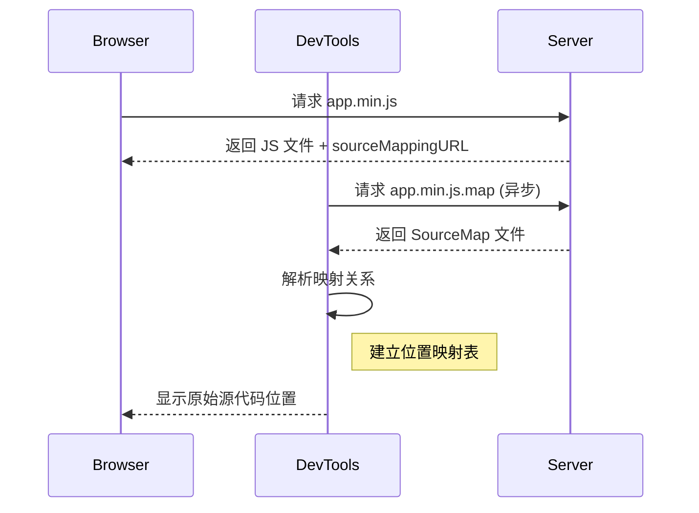
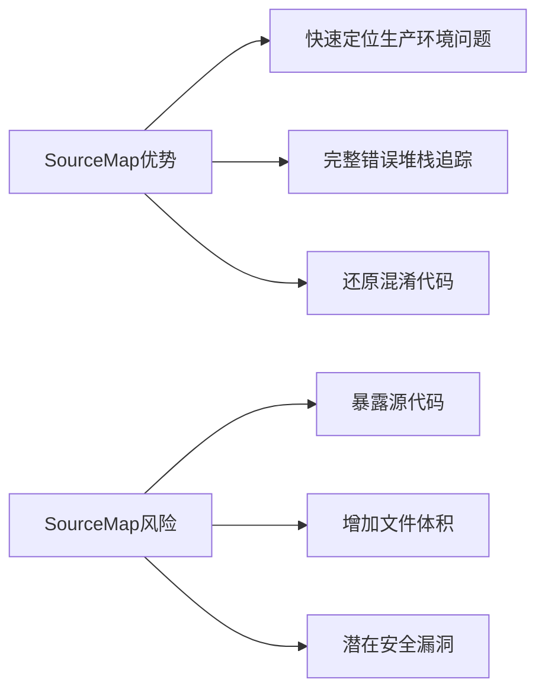
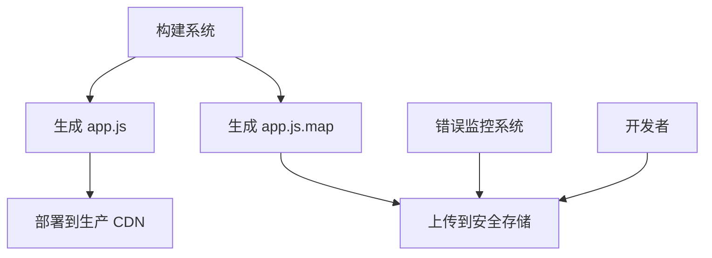

# Vue CLI 项目迁移中样式调试利器：开启 CSS SourceMap 定位源文件

## 前言：一次迁移中的样式之谜

### 问题产生

在最近的项目迁移中，我从 GitHub 上找到一个优秀的 Vue2 后台管理模板，将原有项目的 100 多个业务文件整合到新模板中。迁移完成后，大部分功能运行正常，但**地图功能中的 Marker 图标大小**却出现了明显异常。

**通过浏览器开发者工具检查，发现了一个关键样式规则：**

```css
.amap-icon img,
.amap-marker-content img {
  width: 25px;
  height: 34px;
}
```

但在 VSCode 中进行全局搜索时，却找不到任何包含这些选择器的 CSS 文件。最终发现这些样式被编译到了`app.a9a7ba88.css`文件中——这是 Webpack 构建过程中生成的 CSS 文件。

#### 问题现象对比

**迁移前功能样式**


**迁移后的样式**


## 问题分析：编译后的 CSS 难以追溯

在 Vue CLI 项目中（基于 Webpack），开发环境也会对 CSS 资源进行处理：

1. 所有样式文件（.css, .scss, .less 等）会被合并处理
2. 通过 CSS loader 进行编译和转换
3. 最终生成优化后的 CSS 文件

这使得我们在浏览器中看到的：

- 只有编译后的文件（如`app.a9a7ba88.css`)
- 丢失了原始文件路径信息
- 无法直接定位样式规则的来源

## 解决方案

### 1.临时方案：直接覆盖样式

在全局样式文件中添加强制覆盖：

```css
::v-deep .amap-icon img {
  width: 30px !important;
  height: 30px !important;
}
```

因为地图功能中的 Marker 多处使用，所以需要设置全局 css。

### 2.根本方案：启用 CSS SourceMap

#### 2.1 什么是 SourceMap？

**SourceMap**是一个 JSON 格式的信息文件，它建立了编译后代码与原始源代码之间的映射关系。通过这种映射，开发者工具可以：

- 显示原始文件路径而非编译后的文件名
- 精确定位到源文件中的具体行号
- 在浏览器中直接查看和编辑原始样式文件

#### 2.2 在 Vue CLI 中启用 CSS SourceMap

##### 配置步骤

**1.修改`vue.config.js`：**

```js
// vue.config.js
module.exports = {
  css: {
    sourceMap: true, // 开启 css  source map，
  },
  productionSourceMap: true, // 开启 JS  sourceMap
};
```

**2. 重启开发服务器：**

```bash
npm run serve
```

#### 2.3 验证配置效果

##### 1.`dist`目录


在 `dist` 文件夹中，你将会看到以下几类文件：

- `.css` 和 `.js` 文件是编译后的文件。
- `.gz` 文件是压缩后的文件。
- `.map` 文件是编译后代码与原始源代码之间的映射文件。

##### **2.查看.map 文件**

在这里插入图片描述


**Source Map 文件**

```json
{
  // SourceMap规范版本（当前为3）
  "version": 3,
  // 原始文件路径数组
  "sources": [
    "webpack:///node_modules/@smallwei/avue/lib/index.css",
    "webpack:///node_modules/nprogress/nprogress.css",
    "chunk-vendors.33662982.css",
    "webpack:///node_modules/element-ui/lib/theme-chalk/index.css"
  ],
  // 这个数组包含了源代码中的标识符（如变量名）
  "names": [],
  // 使用Base64 VLQ编码的位置映射信息
  "mappings": "AAAk2gC,gBAAqJ,CCkBv/gC,gBAUM,2CCEN,CC9BiB,oIAAoI,iBAAiB,CAAC,gEAAgE,mBAAmB,CAAC,mdAAmd,eAAe,CAAC,WAAW,yBAAA,CAA0B,wHAAiH,CAAA,eAAoB,CAAA,mBAAkB,CAAA,iBAAA,CAAA,uCAAuC,mCAA+C,CAAA,UAAkB,CAAA,iBAAgB,CAAA,eAAoB,CAAA,mBAAoB,CAAA,mBAAc,CAAA,aAAA,CAAA,uBAA6C,CAAA,oBAAA,CAAA,kCAAmC,CAAA,iCAAkC,CAAA,GAAG,2BAAA,CAA4B,mBAAmB,CAAC,GAAK,+BAAA,CAAiC,uBAAwB,CAAC",
  "file": "chunk-vendors.33662982.css",
  // 原始文件内容
  "sourcesContent": []
}
```

#### 2.4 结果

在 "webpack:///node_modules/@smallwei/avue/lib/index.css"目录下找到对应 css,

```css
.amap-icon img,
.amap-marker-content img {
  width: 25px;
  height: 34px;
}
```

```json
//  package.json
"dependencies":{
   "@smallwei/avue": "2.6.18",
}
```

- 是我迁移时候去掉不用的包的时候，没有`@smallwei/avue`安装导致。

- 因为我不需要这个包，所以/@smallwei/avue/lib/index.css"复制我的项目下

## 思考

### 1.浏览器是如何识别并加载 SourceMap 的

#### 一. 关联标识：建立编译后代码与 SourceMap 的连接

在编译后的文件末尾添加特殊注释：

```js
// JavaScript 文件
//# sourceMappingURL=app.min.js.map

/* CSS 文件 */
/*# sourceMappingURL=styles.css.map */
```

#### 二. 浏览器加载流程

**浏览器执行以下步骤：**

1. **检测请求**：浏览器加载 JS/CSS 文件时检查是否存在 SourceMap 关联
2. **发起请求**：异步请求 SourceMap 文件（不影响主线程）
3. **解析映射**：解析 SourceMap 的 JSON 结构
4. **构建映射表**：创建内存中的映射关系数据库
5. **调试界面转换**：将编译后位置转换为原始位置



### 2. 生成环境 SourceMap 配置最佳实践

SourceMap 是现代前端开发的**调试利器**，但在生产环境中却成为一把**双刃剑**。一方面它提供了无与伦比的调试能力，另一方面却带来安全风险和性能问题



#### 最佳实践：

##### 策略一：完全禁用（适合简单应用）

**适用场景**：

- 小型静态网站
- 无复杂调试需求
- 安全要求极高的应用

**配置示例（Vue CLI）**：

```javascript
// vue.config.js
module.exports = {
  productionSourceMap: false, // 禁用 SourceMap 生成
};
```

##### 策略二：分离部署

编译后源码和 SourceMap 分开部署到不同的服务上。



**实现步骤**：

##### **1.构建配置**：

```js
// vue.config.js
module.exports = {
  productionSourceMap: true,
  configureWebpack: {
    devtool: "hidden-source-map", // 不包含 sourceMappingURL
  },
};
```

##### **2.分开部署**

- 上传资源到 CDN（排除.map 文件）
- 上传 SourceMap 到私有存储

##### **3. 访问控制**：

**只有白名单 Ip 地址才能访问**

```nginx
location ~ \.map$ {
    # IP白名单
    allow 192.168.1.0/24;
    deny all;

    # 基础认证
    auth_basic "SourceMap Access";
    auth_basic_user_file /etc/nginx/.htpasswd;

    # JWT验证
    auth_request /auth;
}

location = /auth {
    internal;
    proxy_pass http://auth-service/verify;
    proxy_pass_request_body off;
    proxy_set_header Content-Length "";
    proxy_set_header X-Original-URI $request_uri;
}
```

##### 4. 手动添加 sourcemap

在浏览器中打开构建之后代码文件，然后右键，就可以看到 add source map 的选项


