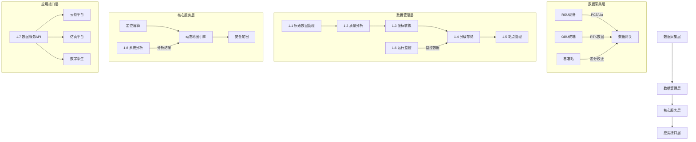

```mermaid

graph TB
  A[数据采集层] --> B[数据管理层]
  B --> C[核心服务层]
  C --> D[应用接口层]

  subgraph 数据采集层
    A1[RSU设备] -->|PC5/Uu| A2[数据网关]
    A3[OBU终端] -->|RTK数据| A2
    A4[基准站] -->|差分校正| A2
  end

  subgraph 数据管理层
    B1[1.1 原始数据管理] --> B2[1.2 质量分析]
    B2 --> B3[1.3 坐标转换]
    B3 --> B4[1.4 分级存储]
    B4 --> B5[1.5 站点管理]
    B6[1.6 运行监控] -->|监控数据| B4
  end

  subgraph 核心服务层
    C1[定位解算] --> C2[动态地图引擎]
    C2 --> C3[安全加密]
    C4[1.8 系统分析] -->|分析结果| C2
  end

  subgraph 应用接口层
    D1[1.7 数据服务API] --> D2[云控平台]
    D1 --> D3[仿真平台]
    D1 --> D4[数字孪生]
  end
```
